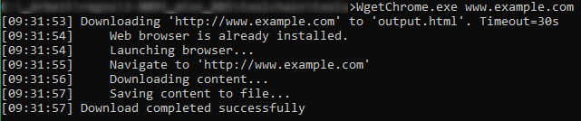

# WgetChrome



Download fully rendered Web Pages via Chrome Browser.

Often web pages loads additional content via Javascript. If these kind of pages are downloaded via CLI tools like `wget` or `curl` the scripts are not executed and the pages are not properly rendered.

With WgetChrome.exe the page is accessed via a Chrome Browser instance and downloaded after the page was fully loaded and rendered.

## Usage

```
> WgetChrome.exe <URL> [OPTIONS]
```

**URL:** URL to navigate to. E.g. `www.example.com`

### Options

Additional options must be passed as `key=value` pair.

| Key | Value |
|-----|-------|
| path | Optional local path to save web page. Directory structure must be exist. Default path = `output.html` |
| timeout | Optional timeout in seconds. Default Timeout = `30s` |
| auth | Basic Authentification token passed in HTTP header |

### Examples

Download page with default settings
```
> WgetChrome.exe www.github.com
```

Download page with authentification
```
> WgetChrome.exe www.github.com/myUser/myRepo auth=myBase64GithubAuthToken
```

## Exit Code

| Value | Description |
|-----|-------|
| 0 | Download was successful |
| 1 | Error occurred. Nothing was saved. |

## FAQ

**Q: Do I need to install the Chrome Browser manually?**

**A:** No, the browser will be automatically downloaded and installed by the integrated Puppeteer Sharp library
when the application is used the first time. This may take ~60sec on the first run.
The browser will be downloaded to `%LOCALAPPDATA%\PuppeteerSharp` and is reused in further runs.
